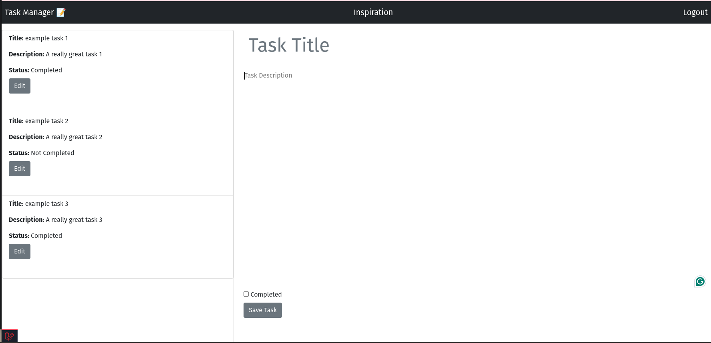

# A Laravel and VueJS App

## Table of content

* [Setup](#setup)

* [Start](#start)

* [Troubleshooting](#troubleshooting)

* [Login](#login)

* [Demo](#demo)

## Setup

1. add the .env based off .env.exmaple 

2. Run the following commands:

`composer require laravel/sail --dev `

`php artisan sail:install `

3. add alias to .bashrc file

` alias sail='[ -f sail ] && sh sail || sh vendor/bin/sail' `
and then restart your shell.

4. Run the following commands:

` composer install `

` sail up `

5. In seperate terminal run the following commands:

`mysql -h 127.0.0.1 -P 3307 -u root -p`

Enter you database password which can be located in the .env file

6. Run the foollowing commands:

`source ./database/schema.sql`

`use task_db`

`source ./database/sample_data.sql`

`exit`

`sail artisan migrate `

7. In seperate terminal run the following commands:

`nvm use 20`

`npm i`

`npx vite build`

`npm run dev `

## Start 
### Application with alias

In one terminal run:

` sail up `

In second terminal run:

`nvm use 20`
` npm run dev `

### Application without alias

In one terminal run:

` ./vendor/bin/sail up `

In second terminal run:

` npm run dev `

## Troubleshooting

### Migrations

if migration doesn't complete run

` sail artisan migrate:fresh `

then run again 

### Models
 
 to inspect individuals models run
 
 ` sail artisan model:show <name of model>`

 ### View routes

 ` sail artisan route:list `

 ### check logs

run the following command:
`less ./storage/logs/laravel.log`

 ## Login

 user:
 fakeuser@gmail.com

 password:
 password

## Demo

See a video of this app being used:
[Click here](https://drive.google.com/file/d/1_TvHqn_vr-3dcv_ioEK-90vIDne-jks-/view?usp=sharing)